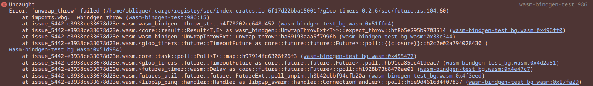

This repository is a reproduction of [libp2p/rust-libp2p#5442](https://github.com/libp2p/rust-libp2p/pull/5442).

## Components

* **bad-peer** - This accepts libp2p WebTransport connections but misbehaves
  on sub-stream allocation. This make `libp2p-ping`'s `ConnectionHandler`
  to be created but then receive a `ConnectionEvent::DialUpgradeError`.
* **isse-5442** - This is the reproduction of the issue that is defined as
  a WASM test case.

## How to run

Terminal No1:

```bash
cd bad-peer
go build .
./bad-peer
```

Terminal No2:

```bash
cd issue-5442
wasm-pack test --chrome
```

Browse to the URL that is printed by the `wasm-pack`. If the output of the page
is stuck on `running 1 test` then the bug was reproduced. You can open browser's
console to view the crash.

> NOTE: If you get `Failed to fetch` error displayed in the page, then you forgot
> to start `bad-peer`.



## Fixes

* Proper fix: [async-rs/futures-timer#74](https://github.com/async-rs/futures-timer/pull/74).
  You can apply it by uncommenting `futures-timer` line in `issue-5442/Cargo.toml`.
* Workaround: [libp2p/rust-libp2p#5447](https://github.com/libp2p/rust-libp2p/pull/5447).
  You can apply it by uncommenting `libp2p` line in `issue-5442/Cargo.toml`.
